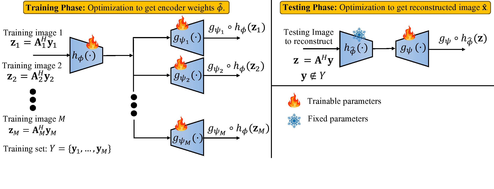
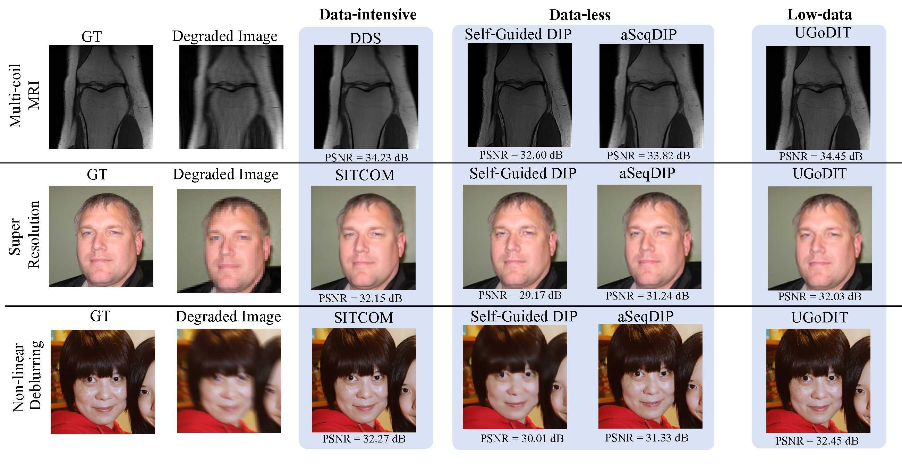

# UGoDIT: Unsupervised Group Deep Image Prior Via Transferable Weights Demos

## NeurIPS 2024

**Authors**: Shijun Liang*, Ismail R. Alkhouri*, Siddhant Gautam, Qing Qu, and Saiprasad Ravishankar. 

### Abstract: 

Recent advances in data-centric deep generative models have led to significant progress in solving inverse imaging problems. However, these models (e.g., diffusion models (DMs)) often require large amounts of fully sampled (clean) training data, which is often impractical to acquire in medical and scientific applications such as dynamic imaging.On the other hand, training-data-free approaches like the Deep Image Prior (DIP) do not require clean ground-truth images but suffer from noise overfitting and can be computationally expensive as the network parameters need to be optimized for each measurement set independently. Moreover, DIP-based methods often overlook the potential of learning a prior using a small number of sub-sampled measurements (or degraded images) available during training. In this paper, we propose \our—an Unsupervised Group DIP with Transferable weights—designed for the low-data regime where only a very small number, $M$, of sub-sampled measurement vectors are available during training. Our method learns a set of transferable weights by optimizing a shared encoder and $M$ disentangled decoders. At test time, we reconstruct the unseen degraded image using a DIP network, where part of the parameters are fixed to the learned weights, while the remaining are optimized to enforce measurement consistency. We evaluate \our on both medical (multi-coil MRI) and natural (super resolution and non-linear deblurring) image recovery tasks under various settings. Compared to recent standalone DIP methods, \our provides accelerated convergence and notable improvement in reconstruction quality. Furthermore, our method achieves performance competitive with SOTA DM-based and supervised approaches, despite not requiring large amounts of clean training data. 


## UGoDIT Illustrative Diagram:


## Results:



### For MRI: 
Download the [fastMRI](https://github.com/microsoft/fastmri-plus/tree/main) dataset. 

### For image restoration: 
Setup the [DPS](https://github.com/DPS2022/diffusion-posterior-sampling) code for the forward models. 

### To cite our paper, use the following: 
```bibtex
@inproceedings{liangNeuIPS25,
author    = {Linag, Shijun and Alkhouri, Ismail and Gautam, Siddhant and Qu, Qing and Ravishankar, Saiprasad },
  title     = {UGoDIT: Unsupervised Group Deep Image Prior Via Transferable Weights Demos},
  booktitle   = {Advances in neural information processing systems (NeurIPS)},
  year      = {2025}
}
